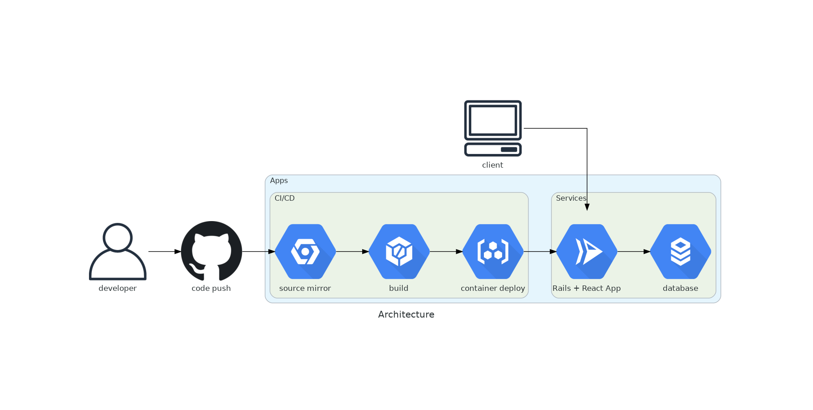

# Diagrams-Docker
Building a Docker environment to use Diagrams.

## Generate diagrams
```
docker-compose run --rm diagram
```

See /tmp/:


## Developing environment
This is a Docker environment to contribute to Diagrams.

```
```